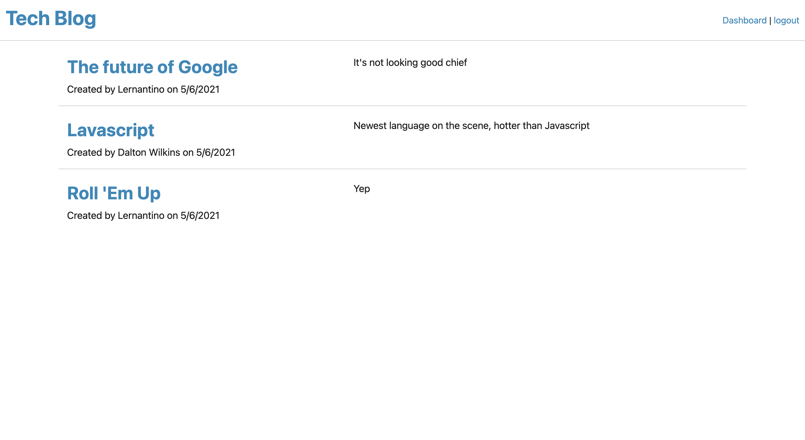

# Tech Blog

## Table of Contents
[Project Link](#Link)  
[Technologies](#Technologies)  
[Description](#Description)  
[Screenshots](#Screenshots)  
[License](#License)  
[Contact](#Contact)

## Link
https://intense-sea-31464.herokuapp.com/

## Technologies
Handlebars, express, node, nodemon, Javascript, MYSQL2, Sequelize, Bcrypt, Dotenv

## Description
A social networking website that allows users to create an account, make blog posts, and leave comments on posts others have made. Users can go to their personal dashboards, where they can see a list of posts they have made and are prompted to make new posts.

## Screenshots

## License
MIT

## Contact
Dalton Wilkins - wilkins.271@osu.edu
